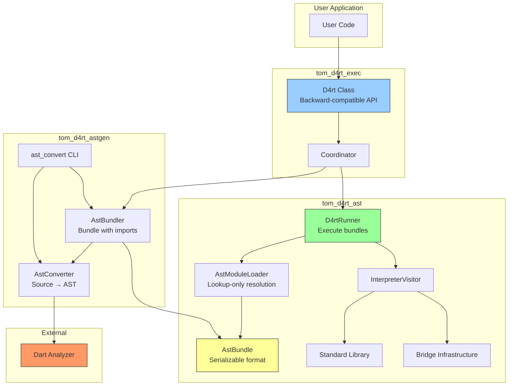
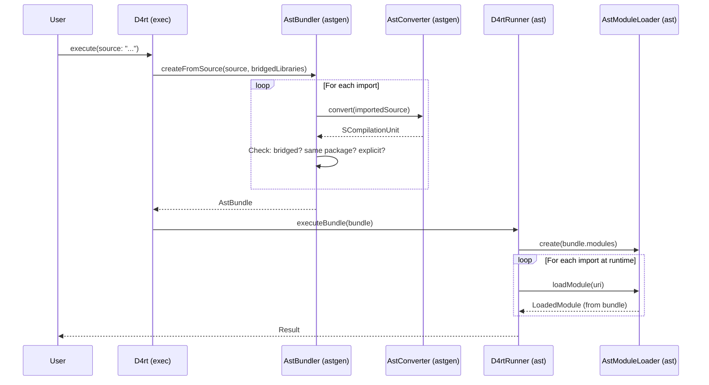
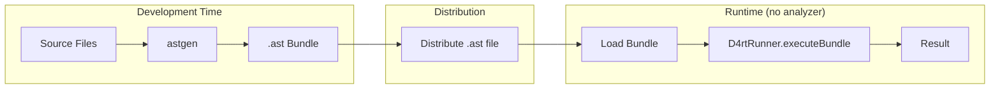

# D4rt AST Architecture Design

## Overview

This document describes the architecture for the D4rt interpreter package split, enabling execution of pre-parsed AST without requiring the Dart analyzer as a dependency.

## Goals

1. **tom_d4rt_ast** - Execute pre-parsed AST bundles without analyzer dependency (lightweight, embeddable)
2. **tom_d4rt_astgen** - Parse Dart source to AST, bundle with import resolution (has analyzer)
3. **tom_d4rt_exec** - **100% API-compatible** drop-in replacement for tom_d4rt, coordinates parsing and execution

## API Compatibility

**tom_d4rt_exec** is designed as a seamless migration target from **tom_d4rt**:

- **Same API**: All public methods have identical signatures
- **Same constructor**: `D4rt()` with no required parameters
- **Drop-in replacement**: Change import from `package:tom_d4rt/tom_d4rt.dart` to `package:tom_d4rt_exec/tom_d4rt_exec.dart`
- **Same behavior**: Existing code works without modification

The analyzer dependency is internal (via tom_d4rt_astgen) - users don't need to interact with it.

## Package Architecture



## Data Flow



## Bundle Distribution Flow



---

## Package APIs

### tom_d4rt_ast

The core runtime package. **No analyzer dependency.**

#### AstBundle

Transportable unit containing entry point and all required modules.

```dart
class AstBundle {
  final String entryPointUri;
  final Map<String, SCompilationUnit> modules;
  
  const AstBundle({required this.entryPointUri, required this.modules});
  
  /// Load from .ast file (ZIP with gzipped JSON ASTs)
  factory AstBundle.fromFile(String path);
  factory AstBundle.fromZip(List<int> bytes);
  
  /// Save to .ast file
  void saveToFile(String path);
  List<int> toZip();
}
```

#### D4rtRunner

Execute pre-parsed AST bundles.

```dart
class D4rtRunner {
  // ─── Bridge Registration ───
  void registerBridgedClass(BridgedClass definition, String library);
  void registerBridgedEnum(BridgedEnumDefinition definition, String library);
  void registerBridgedFunction(NativeFunction function, String library);
  void registerBridgedVariable(LibraryVariable variable, String library);
  void registerBridgedGetter(LibraryGetter getter, String library);
  void registerBridgedSetter(LibrarySetter setter, String library);
  void registerBridgedExtension(BridgedExtensionDefinition definition, String library);
  
  // ─── Permission Management ───
  void grant(Permission permission);
  void revoke(Permission permission);
  bool checkPermission(Permission permission);
  
  // ─── Execution ───
  Future<Object?> executeBundle(
    AstBundle bundle, {
    String? entryPoint,
    List<String>? arguments,
  });
  
  /// Execute single AST (no imports)
  Future<Object?> execute(
    SCompilationUnit ast, {
    String? entryPoint,
    List<String>? arguments,
  });
}
```

#### AstModuleLoader

Lookup-only module resolution from pre-loaded bundle.

```dart
class AstModuleLoader implements ModuleContext {
  final Map<String, SCompilationUnit> modules;
  
  AstModuleLoader({required this.modules, /* bridge definitions */});
  
  @override
  LoadedModule? loadModule(Uri uri);
  
  @override
  bool checkPermission(Permission permission);
}
```

---

### tom_d4rt_astgen

Parsing and bundling. **Has analyzer dependency.**

#### AstConverter

Convert source code to SAstNode tree.

```dart
class AstConverter {
  /// Convert source code string to AST
  SCompilationUnit convert(String source, {String? path});
  
  /// Convert from analyzer's CompilationUnit
  SCompilationUnit convertCompilationUnit(CompilationUnit unit);
}
```

#### AstBundler

Create complete bundles with import resolution.

```dart
class AstBundler {
  /// Create bundle from source code string
  static Future<AstBundle> createFromSource(
    String source, {
    required Set<String> bridgedLibraries,
    Map<String, String>? explicitSources,
    String? sourcePath,
  });
  
  /// Create bundle from file path
  static Future<AstBundle> createFromFile(
    String entryPointPath, {
    required Set<String> bridgedLibraries,
    Map<String, String>? explicitSources,
  });
}
```

#### Import Resolution Rules

| Import Type | Resolution |
|-------------|------------|
| `dart:*` | Skip (stdlib, always available) |
| Exact match in `bridgedLibraries` | Skip (native bridge handles it) |
| `package:same_package/*` | Auto-include (parse recursively) |
| Relative imports within package | Auto-include |
| In `explicitSources` | Include provided source |
| Other `package:*` | **Error** - not bridged |
| Relative imports outside package | **Error** |

---

### tom_d4rt_exec

**100% backward-compatible** replacement for tom_d4rt. Has analyzer via astgen dependency.

#### D4rt

Main API class with **identical signature** to tom_d4rt's D4rt class.

```dart
// Migration: just change the import
// OLD: import 'package:tom_d4rt/tom_d4rt.dart';
// NEW: import 'package:tom_d4rt_exec/tom_d4rt_exec.dart';

final d4rt = D4rt(); // Same constructor, no changes needed
```

```dart
class D4rt {
  // ─── Bridge Registration (forwards to D4rtRunner + tracks URIs) ───
  void registerBridgedClass(BridgedClass definition, String library);
  void registerBridgedEnum(BridgedEnumDefinition definition, String library);
  void registerBridgedFunction(NativeFunction function, String library);
  // ... other registration methods
  
  // ─── Permission Management (forwards to D4rtRunner) ───
  void grant(Permission permission);
  void revoke(Permission permission);
  
  // ─── Execution ───
  
  /// Execute source code (coordinates astgen → runner)
  Future<Object?> execute({
    String? source,
    SCompilationUnit? ast,
    String? entryPoint,
    List<String>? arguments,
    Map<String, String>? explicitSources,
  });
  
  /// Create distributable bundle
  Future<AstBundle> createBundle(
    String entryPointPath, {
    Map<String, String>? explicitSources,
  });
  
  /// Execute pre-made bundle
  Future<Object?> executeBundle(
    AstBundle bundle, {
    String? entryPoint,
    List<String>? arguments,
  });
}
```

---

## Bundle File Format (.ast)

ZIP archive containing gzip-compressed JSON AST files.

```
my_script.ast (ZIP)
├── manifest.json
│   {
│     "version": "1.0",
│     "entryPoint": "bin/main.dart",
│     "files": {
│       "0.ast.json": "bin/main.dart",
│       "1.ast.json": "lib/utils.dart",
│       "2.ast.json": "lib/models/user.dart"
│     }
│   }
├── 0.ast.json (gzip)  ← SCompilationUnit JSON for main.dart
├── 1.ast.json (gzip)  ← SCompilationUnit JSON for utils.dart
└── 2.ast.json (gzip)  ← SCompilationUnit JSON for user.dart
```

---

## Implementation Outline

### Phase 1: AstBundle in tom_d4rt_ast

1. Create `lib/src/runtime/ast_bundle.dart`
   - `AstBundle` class with serialization
   - ZIP/gzip encoding/decoding
   - `fromFile()`, `toFile()`, `fromZip()`, `toZip()`

2. Export from `runtime.dart` barrel

### Phase 2: AstModuleLoader in tom_d4rt_ast

1. Create `lib/src/runtime/ast_module_loader.dart`
   - Implement `ModuleContext` interface
   - Lookup-only resolution from `Map<String, SCompilationUnit>`
   - No file I/O, no parsing

2. Update `D4rtRunner` to use `AstModuleLoader`
   - Add `executeBundle(AstBundle)` method
   - Create `AstModuleLoader` from bundle's modules

### Phase 3: AstBundler in tom_d4rt_astgen

1. Create `lib/src/ast_bundler.dart`
   - `createFromSource()` - parse string and follow imports
   - `createFromFile()` - parse file and follow imports
   - Import resolution logic (bridged, same-package, explicit, error)

2. Update `ast_convert` CLI to support bundle output

### Phase 4: Update tom_d4rt_exec

1. Refactor `D4rt` class
   - Add `D4rtRunner` as internal field
   - Forward all bridge registrations (+ track URIs)
   - Forward all permission methods
   - Implement `execute()` using AstBundler → D4rtRunner
   - Implement `createBundle()` delegating to AstBundler
   - Implement `executeBundle()` delegating to D4rtRunner

2. Ensure backward compatibility
   - All existing tests pass
   - API signatures unchanged

### Phase 5: Testing

1. Unit tests for `AstBundle` serialization round-trip
2. Unit tests for `AstBundler` import resolution
3. Integration tests: source → bundle → execute
4. Verify existing tom_d4rt_exec tests pass
5. Verify existing tom_d4rt_astgen tests pass

---

## Usage Examples

### Simple Execution

```dart
final d4rt = D4rt();

// Register bridges
d4rt.registerBridgedClass(tomBasicsBridge, 'package:tom_basics/tom_basics.dart');

// Execute source directly
final result = await d4rt.execute(source: '''
  import 'package:tom_basics/tom_basics.dart';
  void main() => print('Hello');
''');
```

### Create and Distribute Bundle

```dart
// Development time: create bundle
final d4rt = D4rt();
d4rt.registerBridgedClass(myBridge, 'package:my_lib/my_lib.dart');

final bundle = await d4rt.createBundle('bin/my_app.dart');
bundle.saveToFile('my_app.ast');

// Distribution: ship my_app.ast file

// Runtime: execute bundle (no analyzer needed)
final runner = D4rtRunner();
runner.registerBridgedClass(myBridge, 'package:my_lib/my_lib.dart');

final bundle = AstBundle.fromFile('my_app.ast');
final result = await runner.executeBundle(bundle);
```

### With Explicit External Sources

```dart
final bundle = await d4rt.createBundle(
  'bin/main.dart',
  explicitSources: {
    'package:external_lib/helper.dart': '''
      class Helper {
        static String greet(String name) => 'Hello, \$name!';
      }
    ''',
  },
);
```

---

## Migration Path

### From tom_d4rt to tom_d4rt_exec

**Zero code changes required** - just update the import:

```dart
// Before
import 'package:tom_d4rt/tom_d4rt.dart';

// After
import 'package:tom_d4rt_exec/tom_d4rt_exec.dart';
```

All existing code continues to work unchanged.

### Usage Scenarios

| Scenario | Package | Notes |
|----------|---------|-------|
| Existing tom_d4rt code | tom_d4rt_exec | Drop-in replacement, same API |
| Lightweight runtime (no analyzer) | tom_d4rt_ast | Use D4rtRunner with pre-parsed bundles |
| Bundle distribution | tom_d4rt_ast | Use AstBundle for transportable scripts |

## Dependencies

```
tom_d4rt_ast
├── archive (ZIP handling)
└── (no analyzer!)

tom_d4rt_astgen
├── tom_d4rt_ast
└── analyzer

tom_d4rt_exec
├── tom_d4rt_ast
├── tom_d4rt_astgen
└── analyzer (transitive via astgen)
```

**Note**: tom_d4rt_exec users don't need to directly interact with analyzer or astgen - parsing is handled internally.
