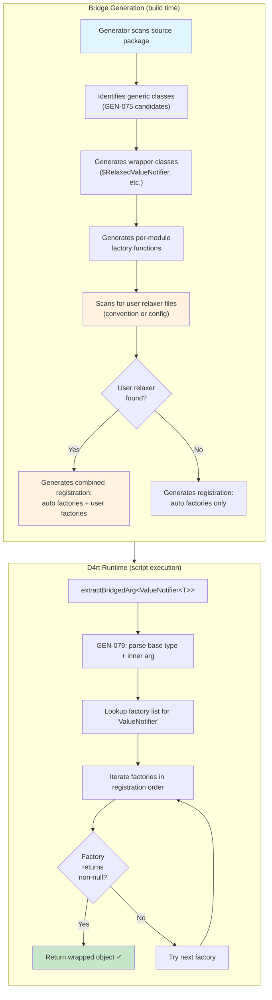
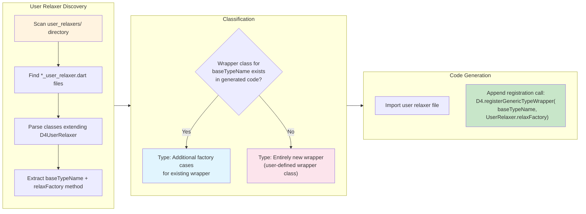
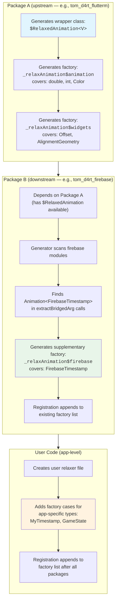
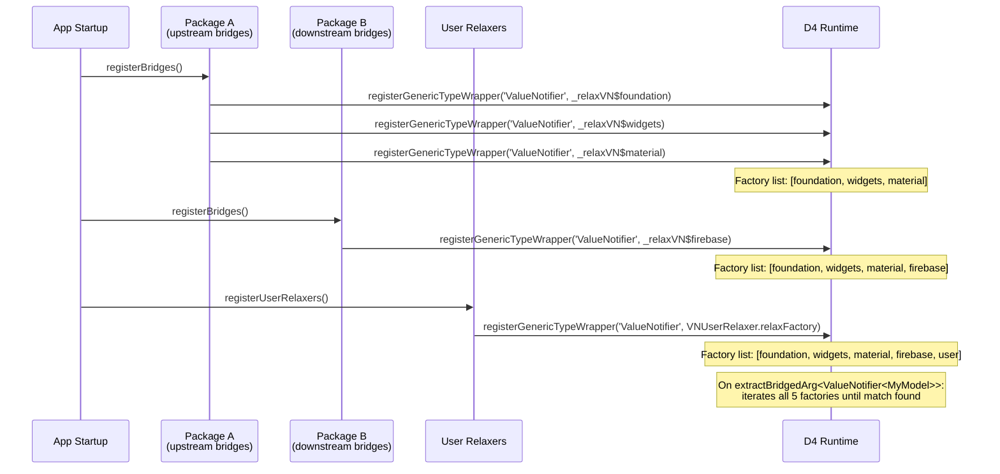
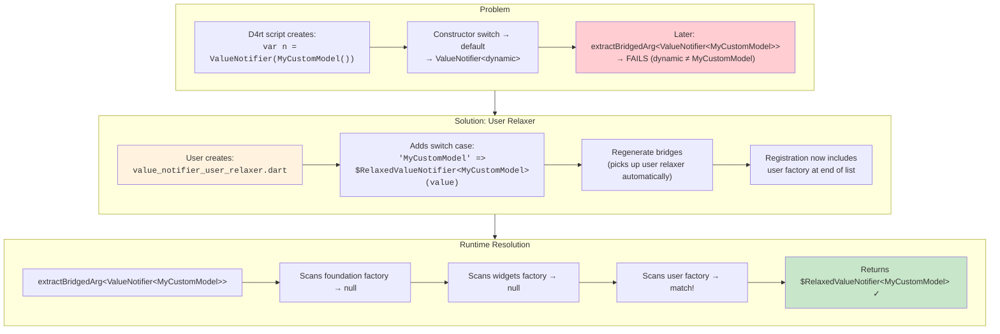

# Generics Wrapper and Type Relaxation Strategy

## Overview

When D4rt creates instances of generic classes (e.g., `ValueNotifier(someValue)`), the resulting object has its type parameter erased to `dynamic` — producing `ValueNotifier<dynamic>` instead of `ValueNotifier<MagnifierInfo>`. Dart's reified generics then enforce invariance at parameter boundaries: `ValueNotifier<dynamic>` genuinely is NOT `ValueNotifier<MagnifierInfo>`, and no cast can bridge the gap.

This document describes the strategy for **auto-generating** type-relaxing wrapper classes and registration code so that every generic base type used in the generated bridges is covered automatically, with no hand-written per-type maintenance.

## Problem Analysis

### Two Layers of Generic Type Erasure

**Layer 1 — Construction (GEN-075/GEN-091):**
When a bridged constructor creates a generic object, the `switch` on the value's runtime type picks the correct type argument — but only for types known to that module's `_classLookup`. Cross-package types fall to the `default` branch, producing `<dynamic>`.

Example: `ValueNotifier` is bridged in the foundation module. Its constructor switch covers all foundation-package types (plus primitives). When a widgets-package type like `MagnifierInfo` is passed, the switch falls through:

```dart
// In foundation_bridges.b.dart — auto-generated GEN-075/091 switch
switch (value) {
  case double _: return ValueNotifier<double>(value);
  case ChangeNotifier _: return ValueNotifier<ChangeNotifier>(value);
  // ... all foundation types ...
  default: return ValueNotifier(value);  // → ValueNotifier<dynamic>
}
```

**Layer 2 — Extraction (GEN-079):**
At the call site (e.g., `CupertinoTextMagnifier(magnifierInfo: notifier)`), `extractBridgedArg<ValueNotifier<MagnifierInfo>>` performs an `is T` check. Because `ValueNotifier<dynamic>` is not a subtype of `ValueNotifier<MagnifierInfo>` in Dart's reified generic model, this check fails.

The only correct fix is to create a **new object** that extends `ValueNotifier<MagnifierInfo>` and delegates to the original instance. This is what a "relaxer wrapper" does.

### Scale of the Problem

Across the current Flutter bridge codebase:

- **10 generic classes** with GEN-075 constructor switches: `ConstantTween`, `AlwaysStoppedAnimation`, `ObjectFlagProperty`, `ValueNotifier`, `ValueKey`, `SynchronousFuture`, `AsyncSnapshot`, `PageStorageKey`, `WidgetStatePropertyAll`, and more in widgets
- **~99 unique generic extraction call sites** in bridge code (`getRequiredNamedArg<Foo<Bar>>`, `getOptionalNamedArg<Foo<Bar?>>`)
- **~28 distinct generic base types** appear across all bridges: `Animation`, `ValueNotifier`, `WidgetStateProperty`, `GlobalKey`, `CustomClipper`, `ImageProvider`, `Route`, `RouterDelegate`, `Tween`, `ValueListenable`, etc.

Currently only 3 of these have hand-written relaxer wrappers (`WidgetStateProperty`, `Animation`, `ValueNotifier`). The remaining ~25 base types have no relaxation support, meaning any cross-package generic use will fail at runtime.

## Current Implementation (Hand-Written — GEN-079)

The current approach lives in `tom_d4rt_flutterm/lib/src/generic_type_relaxers.dart` with three components:

### 1. Wrapper Classes

Each wrapper extends or implements the generic base class with the correct type parameter, delegating to the untyped inner instance:

```dart
class _RelaxedValueNotifier<V> extends ValueNotifier<V> {
  final ValueNotifier _inner;
  _RelaxedValueNotifier(this._inner) : super(_inner.value as V) { ... }
  @override V get value => _inner.value as V;
  @override set value(V newValue) { _inner.value = newValue; super.value = newValue; }
  // ... listener forwarding, dispose ...
}
```

### 2. Factory Functions (Type-Arg Switch)

Each wrapper has a factory that maps inner type argument strings to concrete typed instances:

```dart
Object? _valueNotifierFactory(Object value, String innerTypeArg) {
  if (value is! ValueNotifier) return null;
  return switch (innerTypeArg) {
    'MagnifierInfo' => _RelaxedValueNotifier<MagnifierInfo>(value),
    'EdgeInsets' => _RelaxedValueNotifier<EdgeInsets>(value),
    'Color' => _RelaxedValueNotifier<Color>(value),
    // ... more type args ...
    _ => null,
  };
}
```

### 3. Runtime Registration

Factories are registered at startup via `D4.registerGenericTypeWrapper()`:

```dart
void registerGenericTypeRelaxers() {
  D4.registerGenericTypeWrapper('ValueNotifier', _valueNotifierFactory);
  D4.registerGenericTypeWrapper('Animation', _animationFactory);
  D4.registerGenericTypeWrapper('WidgetStateProperty', _widgetStatePropertyFactory);
}
```

### Runtime Resolution Path

When `extractBridgedArg<ValueNotifier<MagnifierInfo>>` is called:

1. `is T` check fails (`ValueNotifier<dynamic>` is not `ValueNotifier<MagnifierInfo>`)
2. GEN-079 wrapper lookup activates: parses `T.toString()` → base type `ValueNotifier`, inner arg `MagnifierInfo`
3. Finds registered factory for `ValueNotifier`
4. Factory creates `_RelaxedValueNotifier<MagnifierInfo>(innerNotifier)`
5. Result passes the `is T` check

### Problems with Hand-Written Approach

- **No coverage for most generic types** — only 3 of ~28 base types are wrapped
- **Manual maintenance** — every new type argument requires adding a switch case
- **Cross-package awareness** — factory must import types from all packages that might be used as type arguments
- **Incomplete delegation** — easy to miss members when writing wrappers by hand

## Auto-Generation Strategy

### Design Principles

1. **Package-agnostic** — the generator works with any package configured in buildkit.yaml, not only Flutter
2. **Layer-additive** — each module adds factory cases for its own types to wrappers defined in earlier modules
3. **Introspection-based** — wrapper classes are generated from the analyzer's member information, not hand-coded
4. **Type-bound-aware** — type parameters with bounds (e.g., `T extends KeyboardKey`) filter which types can be used as arguments
5. **Lazy map initialization** — runtime uses a list for storage but builds a lookup map on first use for O(1) access

### Architecture

The auto-generated solution has four components:

#### Component 1: Wrapper Class Generation

For each generic class with type parameters (that has bridged constructors and appears in `extractBridgedArg<Base<T>>` call sites), the generator produces a wrapper class in the **module that owns the generic class**.

The generator introspects the class's abstract/virtual members using the existing `ClassInfo`/`MemberInfo` infrastructure and generates delegation code. The proxy generator (`proxy_generator.dart`) already does similar Dart-analyzer-based member introspection for abstract callback proxies — this follows the same pattern.

**Generation rules:**

- **Extends** the base class if it has a suitable constructor (preferred — passes `is BaseType<V>` checks)
- **Implements** the base class if no suitable constructor exists (fallback)
- Delegates all instance getters, setters, methods, and operators to the inner instance
- Uses `as V` casts on return values that involve the type parameter
- For classes like `ValueNotifier` that have mutable state, generates bidirectional synchronization

**Example output** (for `ValueNotifier<T>` in `foundation_bridges.b.dart`):

```dart
/// Auto-generated GEN-079 relaxer wrapper for ValueNotifier<V>.
class $RelaxedValueNotifier<V> extends ValueNotifier<V> {
  final ValueNotifier _inner;
  bool _syncing = false;

  $RelaxedValueNotifier(this._inner) : super(_inner.value as V) {
    _inner.addListener(_forwardNotify);
  }

  void _forwardNotify() {
    if (!_syncing) { _syncing = true; super.value = _inner.value as V; _syncing = false; }
  }

  @override V get value => _inner.value as V;
  @override set value(V newValue) {
    if (!_syncing) { _syncing = true; _inner.value = newValue; super.value = newValue; _syncing = false; }
  }
  @override void dispose() { _inner.removeListener(_forwardNotify); super.dispose(); }
}
```

#### Component 2: Per-Module Factory Functions

Each module generates a factory function that covers the type arguments **from that module's classes only**. The factory uses a switch on the `innerTypeArg` string to create the correctly typed wrapper instance.

**Module generation order matters:** Modules are generated in dependency order (as defined in buildkit.yaml). Each module's factory covers only the types it introduces.

Example for the **widgets module** (which adds `MagnifierInfo`, `EdgeInsets`, etc. to the `ValueNotifier` wrapper):

```dart
/// Auto-generated relaxer factory for ValueNotifier — widgets layer types.
Object? _relaxValueNotifier$widgets(Object value, String innerTypeArg) {
  if (value is! ValueNotifier) return null;
  return switch (innerTypeArg) {
    'MagnifierInfo' => $RelaxedValueNotifier<MagnifierInfo>(value),
    'EdgeInsets' => $RelaxedValueNotifier<EdgeInsets>(value),
    // ... other types introduced in widgets ...
    _ => null,
  };
}
```

The **owning module** (foundation) generates a factory covering primitive types and foundation-local types:

```dart
/// Auto-generated relaxer factory for ValueNotifier — foundation layer types.
Object? _relaxValueNotifier$foundation(Object value, String innerTypeArg) {
  if (value is! ValueNotifier) return null;
  return switch (innerTypeArg) {
    'double' => $RelaxedValueNotifier<double>(value),
    'int' => $RelaxedValueNotifier<int>(value),
    'bool' => $RelaxedValueNotifier<bool>(value),
    'String' => $RelaxedValueNotifier<String>(value),
    // ... foundation types ...
    _ => null,
  };
}
```

#### Component 3: Additive Runtime Registration

The D4 runtime currently stores **one factory per base type name** (`Map<String, GenericTypeWrapperFactory>`). This must change to support additive registration across multiple modules.

**New runtime design:**

```dart
/// Storage: list of factories per base type (preserves registration order).
static final Map<String, List<GenericTypeWrapperFactory>> _genericTypeWrapperLists = {};

/// Lazy-built lookup map: base type → (innerTypeArg → factory index).
/// Built on first use from the list, rebuilt when new factories are registered.
static Map<String, Map<String, int>>? _genericTypeWrapperIndex;

static void registerGenericTypeWrapper(
  String baseTypeName,
  GenericTypeWrapperFactory factory,
) {
  (_genericTypeWrapperLists[baseTypeName] ??= []).add(factory);
  _genericTypeWrapperIndex = null; // invalidate lazy index
}
```

**Resolution (GEN-079 lookup):**

```dart
// In extractBridgedArg<T>:
final factories = _genericTypeWrapperLists[baseTypeName];
if (factories != null) {
  for (final factory in factories) {
    final wrapped = factory(unwrapped, innerTypeArg);
    if (wrapped is T) return wrapped;
  }
}
```

The list iteration is fast because each factory returns `null` immediately for unknown type args (a single switch miss). In practice, the matching factory is found within 1–3 iterations since modules are registered in dependency order and the most specific (latest) module typically has the match.

**Optional optimization — lazy index map:**

For large bridge sets, an optional index can be built on first lookup:

```dart
static Object? _lookupGenericWrapper(String baseTypeName, String innerTypeArg, Object value) {
  final factories = _genericTypeWrapperLists[baseTypeName];
  if (factories == null) return null;

  // Fast path: check the index first
  _genericTypeWrapperIndex ??= _buildIndex();
  final index = _genericTypeWrapperIndex![baseTypeName];
  if (index != null) {
    final factoryIdx = index[innerTypeArg];
    if (factoryIdx != null) {
      return factories[factoryIdx](value, innerTypeArg);
    }
  }

  // Slow path: linear scan (handles nullable variants, etc.)
  for (final factory in factories) {
    final result = factory(value, innerTypeArg);
    if (result != null) return result;
  }
  return null;
}
```

The index is a `Map<String, Map<String, int>>` mapping `baseTypeName → innerTypeArg → factoryListIndex`. It's built lazily on first access and invalidated when new factories are registered (which only happens during bridge setup, before any scripts run).

#### Component 4: Cross-Module Orchestration

The `per_package_orchestrator.dart` already coordinates per-module generation and maintains a `_globalClassLookup`. It needs to be extended to:

1. **Track which generic base types exist** — after scanning module N, record any classes with type parameters that have GEN-075 constructor switches
2. **Collect cross-package type arguments** — for each module, scan the generated `extractBridgedArg<Base<Arg>>` calls to identify which `Arg` types are used with which `Base` types
3. **Generate per-module factory functions** — emit a factory function covering only the `Arg` types owned by that module
4. **Generate registration calls** — in each module's `registerBridges()` function, add `D4.registerGenericTypeWrapper('Base', _relaxBase$moduleName)` calls

The orchestrator passes down to each `BridgeGenerator`:
- **`genericBaseTypes`**: Set of class names from prior modules that need relaxer support
- **`priorModuleTypes`**: Types already covered by prior module factories (to avoid duplicates)

### Type Bound Filtering

When a generic class has a bounded type parameter (e.g., `class TreeSliverNode<T extends Object>`), only type arguments that satisfy the bound should appear in the factory switch. The generator already has this information in `ClassInfo.typeParameters`:

```dart
// ClassInfo.typeParameters: {'T': 'Object'}
// Only types assignable to Object (non-nullable) are valid type args
```

The `_findTypeDispatchParam` method already skips classes with bounded type parameters for GEN-075 switches when the bound is non-trivial. The relaxer generator should apply the same filtering: if `T extends Foo`, only generate switch cases for types that are `Foo` or subtypes of `Foo`.

### What Gets Generated Where

Using the Flutter bridge modules as an example:

| Module | Wrapper Classes Defined | Factory Cases Added |
|--------|-------------------------|---------------------|
| dart_ui | (none — no generic bridged classes in dart:ui) | — |
| foundation | `$RelaxedValueNotifier`, `$RelaxedSynchronousFuture`, `$RelaxedAsyncSnapshot`, `$RelaxedObjectFlagProperty` | Primitives + foundation types |
| animation | `$RelaxedAnimation`, `$RelaxedAnimatable`, `$RelaxedConstantTween`, `$RelaxedAlwaysStoppedAnimation` | Primitives + animation + foundation types |
| painting | — | Factory for `ImageProvider`: painting types |
| services | — | Factory for `MessageCodec`: services types |
| gestures | — | Factory for `HitTestEntry`: gestures types |
| rendering | — | Factory for `CustomClipper`, `Animation`: rendering types |
| widgets | `$RelaxedGlobalKey`, `$RelaxedRoute`, `$RelaxedRouterDelegate`, `$RelaxedValueListenable`, `$RelaxedWidgetStateProperty`, etc. | All widget types as args for all prior wrappers |
| material | — | Material types as args (e.g., `ScaffoldMessengerState` for `GlobalKey`) |
| cupertino | — | Cupertino types as args |

Each later module **imports the wrapper classes** from the module that defines them and only adds new type-arg cases via its own factory function.

### Determining Which Members to Delegate

The generator uses the same analyzer infrastructure that `proxy_generator.dart` uses. For each generic base class:

1. **Collect all instance members** (getters, setters, methods) from `ClassInfo.members`
2. **Filter to those that involve the type parameter** `T` — members whose return type or parameter types contain `T`
3. **Also include all abstract members** that must be overridden (the proxy generator already identifies these)
4. **For members involving `T`**: generate delegation with `as V` casts on return values
5. **For members not involving `T`**: delegate directly without casting (these are just pass-through)

Members that are `final` fields accessed via getters need getter-only delegation. Mutable properties (like `ValueNotifier.value`) need both getter and setter delegation with bidirectional sync.

### Handling Different Generic Patterns

Not all generic classes need the same wrapper strategy:

| Pattern | Example | Strategy |
|---------|---------|----------|
| Simple read-only | `Animation<T>` | Extend, delegate `value` getter with cast |
| Mutable state | `ValueNotifier<T>` | Extend, delegate with bidirectional sync |
| Resolve interface | `WidgetStateProperty<T>` | Implement, delegate `resolve()` with cast |
| Container | `GlobalKey<T extends State>` | May not need wrapper if only used as opaque handle |
| Builder | `Tween<T>` | Extend, delegate `lerp`/`transform` with casts |
| Complex hierarchy | `Route<T>` | Extend if simple constructor exists, implement otherwise |

The generator should detect which pattern applies based on:
- Whether the class is abstract (→ implement) or concrete (→ extend)
- Whether a no-arg or single-arg super constructor exists (→ extend) or not (→ implement)
- How `T` appears in member signatures (return only vs. parameter vs. both)

### Extension Mechanism

The architecture is designed for **extensibility across bridge packages**:

1. **First bridge package** (e.g., `tom_d4rt_flutterm`) generates all wrapper classes and foundation/base factories
2. **Additional bridge packages** (e.g., a hypothetical `tom_d4rt_firebase`) only need to:
   - Depend on the first package (to get the wrapper classes)
   - Generate additional factory functions for their own types
   - Register those factories in their `registerBridges()` call

The additive registration model means no package needs to know about or modify any other package's code. Each package contributes its type-arg cases independently.

### Buildkit Configuration

A new optional key in `buildkit.yaml` enables relaxer generation:

```yaml
d4rtgen:
  generateRelaxers: true        # Enable auto-generated relaxer wrappers
  relaxerOutputPath: lib/src/bridges/relaxers.b.dart  # Where wrapper classes go
  priorRelaxerModules:           # Modules already covered by a dependency package
    - dart_ui
    - foundation
    - animation
```

When `generateRelaxers` is true, the generator:
1. Identifies all generic base types with GEN-075 switches
2. Generates wrapper classes in `relaxerOutputPath` for those owned by this package
3. Generates per-module factory functions in each module's bridge file
4. Adds registration calls to the bridge registration entry point

The `priorRelaxerModules` list tells the generator which modules are already covered by a dependency package's relaxers, so it doesn't regenerate wrapper classes for those base types — it only adds new factory cases.

## User-Extensible Relaxers

### Motivation

The auto-generated relaxer system covers all types that appear in the generated bridges. However, users working with **custom types** or **third-party packages** may need relaxer support for type arguments the generator has never seen. For example:

- A user creates `ValueNotifier<MyCustomModel>` in D4rt script — neither the generator nor the auto-generated factories know about `MyCustomModel`
- A third-party package introduces `Animation<SomeExternalType>` — the generated bridges don't include this type argument
- A downstream bridge package adds classes that should serve as type arguments for generic base types defined upstream

This section describes how users can extend the relaxer system to cover these cases, complementing the **UserBridge Override System** (see [userbridge_override_design.md](userbridge_override_design.md)) which handles per-member bridge overrides.

### Relationship to UserBridge Overrides

The UserBridge override system and the user relaxer extension system solve different problems:

| System | Solves | Scope |
|--------|--------|-------|
| **UserBridge Overrides** | Broken or suboptimal auto-generated bridge members (constructors, getters, methods) | Per class, per member |
| **User Relaxer Extensions** | Missing type argument cases in generic wrapper factories | Per generic base type, per type argument |

They are **complementary** — a user might override a constructor via `FooUserBridge` AND add relaxer factory cases for `Foo<MyType>` via the relaxer extension mechanism. Both are additive; neither requires modifying generated code.

### High-Level Flow



### User Relaxer File Convention

Following the same discovery pattern as UserBridge overrides, user relaxer files are discovered by convention:

| Location | File Pattern | Purpose |
|----------|-------------|---------|
| `{output_dir}/user_relaxers/` | `{base_type}_user_relaxer.dart` | User-added type arg cases for a specific wrapper |
| `{output_dir}/user_relaxers/` | `custom_relaxers.dart` | User-defined wrapper classes for types not in generated bridges |
| `{output_dir}/` | `*_user_relaxer.dart` | Alternative location (flat) |

### Adding Type Arguments to Existing Wrappers

When the generator has already produced a wrapper class (e.g., `$RelaxedValueNotifier<V>`) but the user needs additional type argument cases (e.g., `MyCustomModel`), they create a user relaxer file with a factory function:

```dart
// lib/src/bridges/user_relaxers/value_notifier_user_relaxer.dart
import 'package:tom_d4rt_exec/d4rt.dart' show D4UserRelaxer;
import 'package:tom_d4rt_flutterm/src/bridges/relaxers.b.dart'
    show $RelaxedValueNotifier;
import 'package:my_app/models.dart' show MyCustomModel, MyOtherModel;

/// User-provided relaxer factory for ValueNotifier.
///
/// Adds type argument cases for app-specific types that
/// the auto-generated factories don't cover.
class ValueNotifierUserRelaxer extends D4UserRelaxer {
  /// The generic base type this relaxer extends.
  @override
  String get baseTypeName => 'ValueNotifier';

  /// Factory function matching GenericTypeWrapperFactory signature.
  static Object? relaxFactory(Object value, String innerTypeArg) {
    if (value is! ValueNotifier) return null;
    return switch (innerTypeArg) {
      'MyCustomModel' => $RelaxedValueNotifier<MyCustomModel>(value),
      'MyOtherModel' => $RelaxedValueNotifier<MyOtherModel>(value),
      _ => null,
    };
  }
}
```

The generator discovers this file and appends the registration call after the auto-generated factories:

```dart
// In the generated registration function:
void registerRelaxers() {
  // Auto-generated factories (module layers)
  D4.registerGenericTypeWrapper('ValueNotifier', _relaxValueNotifier$foundation);
  D4.registerGenericTypeWrapper('ValueNotifier', _relaxValueNotifier$widgets);
  D4.registerGenericTypeWrapper('ValueNotifier', _relaxValueNotifier$material);
  // User-provided factory (discovered from user relaxer file)
  D4.registerGenericTypeWrapper('ValueNotifier', ValueNotifierUserRelaxer.relaxFactory);
}
```

### Adding Entirely New Wrapper Classes

When the user needs a relaxer for a generic base type that the generator didn't produce a wrapper for (either because the class wasn't in the generated bridges, or because it's from a third-party package), they write both the wrapper class and the factory:

```dart
// lib/src/bridges/user_relaxers/custom_relaxers.dart
import 'package:tom_d4rt_exec/d4rt.dart' show D4UserRelaxer;
import 'package:third_party/reactive.dart' show ReactiveStream;
import 'package:my_app/models.dart' show SensorData, EventPayload;

/// User-provided wrapper for ReactiveStream<V>.
/// The generator doesn't know about this third-party type.
class $RelaxedReactiveStream<V> implements ReactiveStream<V> {
  final ReactiveStream _inner;
  $RelaxedReactiveStream(this._inner);

  @override
  V get current => _inner.current as V;

  @override
  Stream<V> get stream => _inner.stream.cast<V>();

  @override
  void listen(void Function(V) callback) =>
      _inner.listen((v) => callback(v as V));
}

/// User relaxer registration for ReactiveStream.
class ReactiveStreamUserRelaxer extends D4UserRelaxer {
  @override
  String get baseTypeName => 'ReactiveStream';

  static Object? relaxFactory(Object value, String innerTypeArg) {
    if (value is! ReactiveStream) return null;
    return switch (innerTypeArg) {
      'SensorData' => $RelaxedReactiveStream<SensorData>(value),
      'EventPayload' => $RelaxedReactiveStream<EventPayload>(value),
      _ => null,
    };
  }
}
```

### Generator Integration Flow



### The D4UserRelaxer Base Class

Similar to how UserBridge overrides use `D4UserBridge` as a marker base class, user relaxers extend `D4UserRelaxer`:

```dart
/// Base class for user-provided relaxer factories.
///
/// Extend this class to add type argument cases to existing
/// auto-generated relaxer wrappers, or to register entirely
/// new wrapper classes for generic types not covered by generation.
///
/// Classes extending D4UserRelaxer are automatically excluded
/// from bridge generation (same as D4UserBridge).
abstract class D4UserRelaxer {
  /// The unparameterized base type name this relaxer targets.
  /// E.g., 'ValueNotifier', 'Animation', 'ReactiveStream'.
  String get baseTypeName;
}
```

### Generator Producing Additional Entries for Existing Wrappers

When a **downstream bridge package** generates bridges for additional modules that use generic types from upstream, the generator can produce supplementary factory entries without regenerating the wrapper classes. This is the same mechanism that makes layer-additive generation work, but extended to cross-package scenarios.



The key principle: **wrapper classes are defined once** (in the owning package), but **factory functions are additive** across packages and user code. The runtime's list-based registration ensures all sources contribute without conflicts.

### How the Generator Produces Supplementary Factories

When processing a downstream package or module, the generator:

1. **Receives `priorRelaxerModules`** from config — knows which upstream wrapper classes exist
2. **Scans the current module's generated bridge code** for `extractBridgedArg<Base<Arg>>` patterns
3. **Compares `Arg` types against prior modules** — if `Arg` is new (not covered upstream), it's a candidate
4. **Emits a supplementary factory function** referencing the upstream wrapper class:

```dart
// Generated in firebase_bridges.b.dart (downstream package)
// Uses $RelaxedAnimation from upstream tom_d4rt_flutterm package
import 'package:tom_d4rt_flutterm/src/bridges/relaxers.b.dart'
    show $RelaxedAnimation;

Object? _relaxAnimation$firebase(Object value, String innerTypeArg) {
  if (value is! Animation) return null;
  return switch (innerTypeArg) {
    'FirebaseTimestamp' => $RelaxedAnimation<FirebaseTimestamp>(value),
    'FirebaseUser' => $RelaxedAnimation<FirebaseUser>(value),
    _ => null,
  };
}
```

5. **Adds the registration** in the downstream package's `registerBridges()`:

```dart
D4.registerGenericTypeWrapper('Animation', _relaxAnimation$firebase);
```

### Complete Registration Order

The runtime sees factory registrations in a well-defined order that ensures correct resolution:



### Buildkit Configuration for User Relaxers

```yaml
d4rtgen:
  generateRelaxers: true
  relaxerOutputPath: lib/src/bridges/relaxers.b.dart
  # Optional: explicit path to user relaxer files
  userRelaxerPath: lib/src/bridges/user_relaxers/
  # Alternatively: discovered by convention from output directory
```

### Complete File Structure

```
lib/
  src/
    bridges/
      # Auto-generated
      relaxers.b.dart                  # Wrapper classes ($RelaxedAnimation, etc.)
      foundation_bridges.b.dart        # Includes _relaxVN$foundation factory
      widgets_bridges.b.dart           # Includes _relaxVN$widgets factory
      material_bridges.b.dart          # Includes _relaxVN$material factory
      flutter_bridges_barrel.b.dart    # Registration calls all factories

      # User-maintained
      user_bridges/                    # UserBridge overrides (per-member)
        my_list_user_bridge.dart
      user_relaxers/                   # User relaxer extensions (per-type-arg)
        value_notifier_user_relaxer.dart    # Extra VN type args
        custom_relaxers.dart                # Entirely new wrapper + factory
```

### End-to-End Example: User Adds MyCustomModel Support



### Design Constraints

- **User relaxer files are never overwritten** by the generator (same guarantee as UserBridge files)
- **User wrapper classes** should follow the `$Relaxed{BaseType}<V>` naming convention for consistency, but this is not enforced
- **Factory method must be static** and named `relaxFactory` with the `GenericTypeWrapperFactory` signature: `Object? Function(Object value, String innerTypeArg)`
- **User factories are always registered last** — they act as a catch-all after all generated factories
- The **`D4UserRelaxer` marker class** ensures the generator excludes these files from bridge generation (same as `D4UserBridge`)

## CRITICAL: Package API Sync (tom_d4rt_ast ↔ tom_d4rt ↔ tom_d4rt_exec)

> **This is one of the most important principles in the D4rt quest.**

The generic type relaxer runtime APIs — `registerGenericTypeWrapper()`, `_genericTypeWrappers`/`_genericTypeWrapperLists`, and the GEN-079 resolution path in `extractBridgedArg` — live in **tom_d4rt_ast** (specifically in the `D4` class). Any changes to these APIs **must** be propagated to keep the three packages in sync:

| Package | Role | Sync Requirement |
|---------|------|-------------------|
| **tom_d4rt_ast** | Runtime implementation — owns the actual wrapper registry, factory lists, and `extractBridgedArg` integration | Primary: changes originate here |
| **tom_d4rt** | Public-facing API — re-exports tom_d4rt_ast types and provides the interpreter entry point | Must mirror all public API additions/changes from tom_d4rt_ast |
| **tom_d4rt_exec** | Execution engine — provides forwarding calls to tom_d4rt_ast | Must add forwarding methods for any new/changed APIs so its consumers see the same interface |

### What This Means for Relaxer Changes

Every phase of the migration below touches tom_d4rt_ast runtime APIs. For each change:

1. **Implement in tom_d4rt_ast** — this is where `D4`, `registerGenericTypeWrapper`, and the GEN-079 resolution live
2. **Update tom_d4rt** — ensure the public API surface re-exports or exposes the new functionality (e.g., new `D4UserRelaxer` base class, additive registration methods)
3. **Update tom_d4rt_exec** — add forwarding calls to the tom_d4rt_ast implementation so that consumers using tom_d4rt_exec have equivalent access
4. **Test across all three** — verify that wrapper registration and type relaxation work whether accessed through tom_d4rt or tom_d4rt_exec

This applies to Phase 1 changes (additive registry, `D4UserRelaxer`), any future wrapper factory signature changes, and the lazy index map optimization.

## Migration Path

### Phase 1: Runtime Changes (tom_d4rt_ast) + API Sync

> **Clean break — no backward compatibility.** The existing hand-written relaxers
> in `generic_type_relaxers.dart` (3 wrappers for `ValueNotifier`, `Animation`,
> `WidgetStateProperty`) will be **deleted entirely** once the auto-generated
> replacements are in place. Phase 1 changes the runtime API to the new additive
> list-based model immediately; there is no transition period where old and new
> coexist.

1. Change `_genericTypeWrappers` from `Map<String, Factory>` to `Map<String, List<Factory>>`
2. Make `registerGenericTypeWrapper` additive (append to list)
3. Update GEN-079 resolution in `extractBridgedArg` to iterate the list
4. Add lazy index map for optimized lookups
5. Add `D4UserRelaxer` abstract base class (marker class, parallel to `D4UserBridge`)
6. **Sync tom_d4rt** — mirror new/changed public APIs
7. **Sync tom_d4rt_exec** — add forwarding calls to tom_d4rt_ast for all new registration and resolution methods
8. **Test all three packages** — ensure relaxer registration works via tom_d4rt and tom_d4rt_exec entry points

### Phase 2: Generator Changes (tom_d4rt_generator)

1. Add wrapper class generation to `bridge_generator.dart` using analyzer member introspection
2. Add per-module factory generation following the layer-additive model
3. Update `per_package_orchestrator.dart` to track generic base types across modules
4. Add `generateRelaxers` config parsing to `bridge_config.dart`
5. Add `UserRelaxerScanner` to discover `*_user_relaxer.dart` files (parallel to `UserBridgeScanner`)
6. Generate combined registration calls: auto-generated factories first, then user factories

### Phase 3: Regenerate and Validate (tom_d4rt_flutterm and all other package using tom_d4rt_generator for bridge registrations, e.g. tom_d4rt_dcli, tom_dcli_exec, tom_core_d4rt, tom_vscode_bridge)

> **Complete replacement.** The hand-written `generic_type_relaxers.dart` and its
> `registerGenericTypeRelaxers()` call are deleted — not preserved as fallbacks.
> All relaxer functionality is provided by the auto-generated code from this point
> forward.

1. Add config to `buildkit.yaml`
2. Regenerate all bridge files (produces auto-generated wrapper classes + per-module factories)
3. **Delete** hand-written `generic_type_relaxers.dart` entirely
4. **Remove** the `registerGenericTypeRelaxers()` call from bridge registration entry point
5. Run full test suite to validate all ~99 generic extraction sites work
6. Verify no regressions in the 1970+ existing passing tests

## Related: Proxy Class Generation

The [proxy class generation system](proxy_class_generation.md) is a separate mechanism that shares structural similarities with generic type relaxers. Both generate delegation classes that extend a base type, both use analyzer-based introspection of class members, and both register with the D4 runtime via `D4.register*()` methods resolved in `extractBridgedArg<T>`.

The key difference: proxy classes solve the problem of D4rt scripts **subclassing abstract classes** (e.g., `CustomPainter`), while relaxers solve **generic type parameter erasure** (e.g., `ValueNotifier<dynamic>` → `ValueNotifier<MagnifierInfo>`). Generic proxy classes like `D4rtCustomClipper<T>` sit at the intersection — the proxy handles abstract method delegation while type parameter erasure in factory closures is handled separately.

See [proxy_class_generation.md](proxy_class_generation.md) for full details.

## Summary

> **This is a full replacement, not an incremental enhancement.** The hand-written
> `generic_type_relaxers.dart` (3 wrappers, ~35 switch cases) will be deleted
> entirely. There is no coexistence period — Phase 3 removes all hand-written
> relaxer code and replaces it with auto-generated equivalents.

| Aspect | Current (Hand-Written — to be deleted) | Target (Auto-Generated — full replacement) |
|--------|----------------------|------------------------|
| Wrapper classes | 3 (manual) | ~28 (all generic base types, auto-generated) |
| Factory cases | ~35 switch cases (manual) | All known type args per module (auto-generated) |
| New module support | Edit relaxers file by hand | Just regenerate — new types picked up automatically |
| Cross-package types | Must manually add imports | Generator knows the full type graph |
| Maintenance burden | High — every new type arg needs a hand-edit | Zero — regeneration covers everything |
| User extensibility | Must edit shared file | Separate user relaxer files, never overwritten |
| Cross-package extension | Not supported | Downstream packages add factories additively |
| Runtime lookup | Single factory per base type | List of factories with lazy index map |
## Hand-Written Files (To Be Removed After Auto-Generation)

> **IMPORTANT:** The following hand-written files contain manual implementations that
> must be **deleted entirely** once the D4rt generator produces equivalent auto-generated
> code. They exist as interim solutions and must not be maintained alongside generated code.

### File 1: `tom_d4rt_flutterm/lib/src/generic_type_relaxers.dart`

**Purpose:** Hand-written GEN-079 type-relaxing wrapper classes and factory functions for 3 generic base types.

**Contents:**
- `registerGenericTypeRelaxers()` — registers 3 wrapper factories with `D4.registerGenericTypeWrapper`
- `_RelaxedWSP<V>` — wrapper for `WidgetStateProperty<V>` (implements, delegates `resolve()`)
- `_RelaxedAnimation<V>` — wrapper for `Animation<V>` (extends, delegates `value`, `status`, listeners)
- `_RelaxedValueNotifier<V>` — wrapper for `ValueNotifier<V>` (extends, bidirectional sync)
- Factory functions: `_widgetStatePropertyFactory`, `_animationFactory`, `_valueNotifierFactory`
- ~35 total switch cases across the 3 factories

**Replacement:** The relaxer generator (`relaxer_generator.dart`) already auto-generates `$Relaxed*` wrapper classes and per-module factory functions in `flutter_relaxers.b.dart`. Once the generated output covers all 3 base types with equivalent or better type coverage, this file should be deleted and its `registerGenericTypeRelaxers()` call removed from the bridge registration entry point.

### File 2: `tom_d4rt_flutterm/lib/src/d4rt_runtime_registrations.dart`

**Purpose:** Hand-written runtime registrations for interface proxies (RC-1), type coercions (RC-3), generic constructor factories (RC-2), and supplementary methods.

**Contents:**
- `registerD4rtRuntimeExtensions()` — entry point calling 4 sub-registration functions
- **RC-1 Interface Proxies** (4 registrations):
  - `TickerProvider` — proxy delegating `createTicker()` to interpreter
  - `CustomClipper` — proxy delegating `getClip()`, `shouldReclip()`
  - `StatelessWidget` — proxy delegating `build()` to interpreter
  - `StatefulWidget` — proxy delegating `createState()` with full lifecycle
- **RC-1 Proxy Widget Classes** (3 classes):
  - `_InterpretedStatelessWidget`, `_InterpretedStatefulWidget`, `_InterpretedState`
- **RC-3 Type Coercions** (2 registrations):
  - `painting.TextStyle` → `dart:ui.TextStyle` (via `getTextStyle()`)
  - `painting.StrutStyle` → `dart:ui.StrutStyle` (field-by-field conversion)
- **RC-2 Generic Constructor Factories** (4 registrations):
  - `GlobalKey<T>` — type-dispatch for `NavigatorState`, `FormState`, `ScaffoldState`
  - `ValueKey<T>` — type-dispatch for `String`, `int`
  - `ValueNotifier<T>` — type-dispatch for `dynamic`, `String`, `int`, `double`, `bool`
  - `StrutStyle` — constructor override redirecting `dart:ui.StrutStyle` to `painting.StrutStyle`
- **Supplementary Methods** (2 registrations):
  - `ChangeNotifier.notifyListeners` — @protected method access
  - `ChangeNotifier.hasListeners` — @protected getter access

**Replacement:** Each section has a different auto-generation path:
- **RC-1 Interface Proxies + Widget Proxies:** Covered by the proxy generator (`GEN-083`). The `generateProxies` config in `buildkit.yaml` already lists proxy target classes. Once the proxy generator can emit interface proxy registrations and widget delegation classes, this section can be auto-generated.
- **RC-3 Type Coercions:** Cross-package type coercions are specific to Flutter's split-package architecture (`dart:ui` vs `painting`). These may need to remain hand-written or require a new coercion discovery mechanism in the generator.
- **RC-2 Generic Constructor Factories:** Not yet auto-generated. See [generic_constructor_and_other_extensions.md](generic_constructor_and_other_extensions.md) for full analysis.
- **Supplementary Methods:** `@protected` methods are deliberately excluded by the bridge generator. A supplementary method scanner could detect these automatically, but the cases are few enough that hand-writing may be acceptable.

## Gap Analysis: Implementation vs. Design

> **Last verified:** 12 March 2026
>
> This section compares the design described in this document against the
> actual implementation state. Items are categorized as Implemented, Partially
> Implemented, or Not Implemented.

### Phase 1: Runtime Changes

| Design Item | Status | Evidence |
|------------|--------|---------|
| `_genericTypeWrappers` is `Map<String, List<Factory>>` (list-based) | **Implemented** | `tom_d4rt_ast d4.dart:122` — `Map<String, List<GenericTypeWrapperFactory>>` |
| `registerGenericTypeWrapper` appends to list | **Implemented** | `d4.dart:191` — `(_genericTypeWrappers[baseTypeName] ??= []).add(factory)` |
| GEN-079 resolution iterates factory list | **Implemented** | `d4.dart:744-752` — `for (final factory in factories)` loop |
| Lazy index map for O(1) inner lookups | **Not Implemented** | No `_genericTypeWrapperIndex`, `_buildIndex`, or lazy map rebuilding code exists. The outer lookup is O(1) by base type name; inner iteration is sequential. This is an **optional optimization** described in the design doc and is not blocking. |
| `D4UserRelaxer` abstract base class | **Implemented** | `tom_d4rt_ast d4.dart:1362` — abstract class with `baseTypeName` getter |
| Sync tom_d4rt — mirror APIs | **Implemented** | `tom_d4rt d4.dart` has matching list-based registry, `D4UserRelaxer`, and re-exports |
| Sync tom_d4rt_exec — forwarding calls | **Implemented** | `tom_d4rt_exec` re-exports `tom_d4rt_ast` via `d4rt.dart`, providing transitive access |

### Phase 2: Generator Changes

| Design Item | Status | Evidence |
|------------|--------|---------|
| **Component 1:** Wrapper class generation using analyzer member introspection | **Implemented** | `relaxer_generator.dart` generates `$Relaxed*` classes — 42 wrapper classes in `flutter_relaxers.b.dart`. Uses extends-vs-implements strategy based on constructor suitability. |
| **Component 2:** Per-module factory functions (`_relax{Base}${module}`) | **Implemented** | 124 per-module factory functions generated in `flutter_relaxers.b.dart` with correct naming pattern |
| **Component 3:** `registerRelaxers()` function with all registration calls | **Implemented** | Generated `registerRelaxers()` emits all `D4.registerGenericTypeWrapper()` calls, invoked from `flutter_d4rt.dart:54` |
| **Component 4:** Cross-module orchestration tracking `genericBaseTypes` | **Not Implemented** | `per_package_orchestrator.dart` has no `genericBaseTypes` or `priorModuleTypes` tracking. Relaxer data flows through `GenericExtractionSite` parameters, not through orchestrator-level state. The relaxer generator works correctly but doesn't track base types as a first-class orchestrator concept — it receives all data as function parameters. |
| `generateRelaxers` config key in buildkit.yaml | **Not Implemented** | No `generateRelaxers` boolean field in `BridgeConfig`. Relaxer generation is always automatic when `relaxerOutputPath` is set. This is acceptable — the design doc describes it as optional, and always-on generation is simpler. |
| `relaxerOutputPath` config | **Implemented** | `bridge_config.dart:389` — parsed from YAML, defaults to `lib/src/relaxers.b.dart` |
| `priorRelaxerModules` config | **Implemented** | `bridge_config.dart:404` — parsed as `List<String>` from YAML |
| `userRelaxerPath` config | **Not Implemented** | No explicit `userRelaxerPath` field in `BridgeConfig`. The scanner uses a convention: `user_relaxers/` subdirectory relative to relaxer output. Design doc lists this as an alternative — convention-based discovery is the implemented path. |
| `UserRelaxerScanner` class | **Partially Implemented** | No dedicated `UserRelaxerScanner` class exists. Instead, a `scanUserRelaxers()` function at `relaxer_generator.dart:1059` performs the same scanning. It discovers `*_user_relaxer.dart` files in `user_relaxers/` subdirectory and parses `relax{TypeName}` functions. Functionally equivalent but not a separate scanner class as designed. |
| Combined registration: auto factories + user factories | **Implemented** | `relaxer_generator.dart:212` calls `scanUserRelaxers()` and the generated `registerRelaxers()` includes both auto-generated and user-provided factory registrations |

### Phase 3: Regenerate and Validate

| Design Item | Status | Evidence |
|------------|--------|---------|
| Hand-written `generic_type_relaxers.dart` deleted | **Implemented** | File no longer exists — confirmed via filesystem check |
| `registerGenericTypeRelaxers()` call removed | **Implemented** | `flutter_d4rt.dart:54` now calls `registerRelaxers()` (auto-generated) instead |
| Auto-generated `flutter_relaxers.b.dart` covers all types | **Implemented** | 42 wrapper classes, 124 factory functions, 124 `registerGenericTypeWrapper` calls |
| Full test suite validated | **Implemented** | Tests pass (690 pass, 16 fail — all pre-existing platform-specific) |

### Summary of Remaining Gaps

| Gap | Severity | Recommendation |
|-----|----------|---------------|
| **Lazy index map** not implemented | **Low** | Optional optimization. Sequential factory iteration is fast in practice (1–3 iterations). Implement only if profiling shows hot path. |
| **Orchestrator tracking** of generic base types | **Low** | Current approach works via parameter passing. Adding orchestrator-level tracking would improve code organization but doesn't affect correctness or completeness. |
| **`generateRelaxers` config flag** missing | **None** | Always-on generation when `relaxerOutputPath` is set is simpler and sufficient. |
| **`userRelaxerPath` config** missing | **None** | Convention-based discovery (`user_relaxers/` subdirectory) is the implemented and documented alternative. |
| **`UserRelaxerScanner` as dedicated class** missing | **None** | The `scanUserRelaxers()` function provides equivalent functionality. A class refactor would improve testability but is not a functional gap. |

### Conclusion

The design document's core functionality is **fully implemented**:

- **Phase 1 (Runtime):** Complete — list-based additive registry, D4UserRelaxer, three-package sync
- **Phase 2 (Generator):** Complete — wrapper class generation, per-module factories, user relaxer scanning, config parsing
- **Phase 3 (Regeneration):** Complete — hand-written relaxers deleted, auto-generated replacements active, tests passing

The remaining gaps are all **optional optimizations or organizational preferences** (lazy index map, orchestrator-level tracking, dedicated scanner class). None affect correctness or coverage.

**Not covered by this document** (see [generic_constructor_and_other_extensions.md](generic_constructor_and_other_extensions.md)):
- RC-2 generic constructor factory auto-generation (`registerGenericConstructor`)
- RC-1 interface proxy auto-generation (`registerInterfaceProxy`)
- RC-3 type coercion registrations
- RC-5 supplementary method registrations
