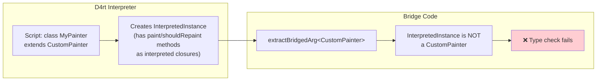
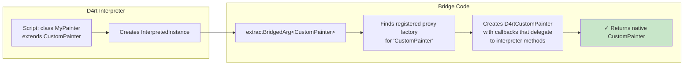
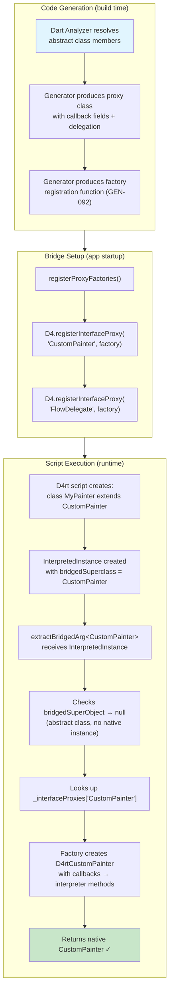
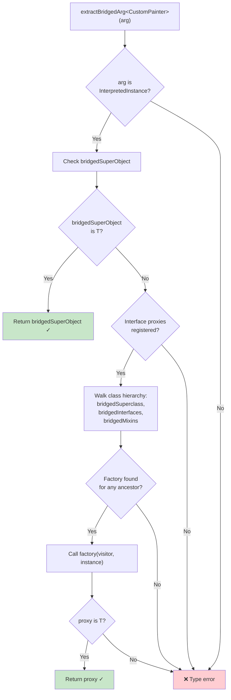
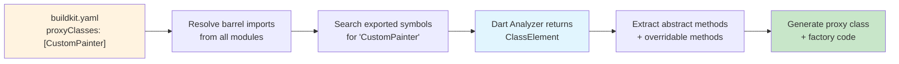

# Proxy Class Generation

## Overview

The D4rt bridge generator provides an **auto-generation system for proxy classes** — native Dart subclasses of abstract classes that delegate their abstract method implementations to callback functions. This enables D4rt-interpreted scripts to create subclasses of abstract framework classes (like `CustomPainter`, `FlowDelegate`, or `DataTableSource`) without needing hand-written native code for each one.

Proxy classes solve a fundamental problem: Dart's abstract classes require concrete method implementations at compile time, but D4rt scripts define their method bodies at runtime through the interpreter. The proxy class acts as the compile-time bridge — it extends the abstract class with concrete methods that, at runtime, call back into the interpreter to execute the script-defined logic.

## Problem Statement

Consider a D4rt script that wants to create a custom painter:

```dart
// D4rt script
class MyPainter extends CustomPainter {
  @override
  void paint(Canvas canvas, Size size) {
    canvas.drawCircle(Offset(100, 100), 50, Paint());
  }

  @override
  bool shouldRepaint(CustomPainter oldDelegate) => false;
}

// Usage
final widget = CustomPaint(painter: MyPainter());
```

Flutter's `CustomPaint` widget expects a **native** `CustomPainter` instance. The D4rt interpreter creates an `InterpretedInstance` — an internal representation that is NOT a native `CustomPainter`. Without a proxy, passing this to `CustomPaint` would fail with a type error.

### What Happens Without Proxies



### What Happens With Proxies



## Architecture

The proxy system has three layers:

1. **Proxy Class** — a concrete Dart subclass of the target abstract class, with callback fields for each abstract method
2. **Proxy Factory Registration** — registers a factory function with `D4.registerInterfaceProxy()` that creates proxy instances from `InterpretedInstance` objects
3. **Runtime Resolution** — `extractBridgedArg<T>` checks registered proxy factories when it encounters an `InterpretedInstance` whose class hierarchy includes a bridged abstract type



## Generated Output

### Proxy Class Structure

For each configured abstract class, the generator produces a concrete subclass with:

- **Required callback fields** for each abstract method (the script MUST implement these)
- **Optional callback fields** for each overridable (concrete) method (the script MAY override these)
- A **constructor** accepting all callbacks
- **Override methods** that delegate to the callbacks (or fall back to `super` for optional ones)

Example — generated `D4rtCustomPainter`:

```dart
class D4rtCustomPainter extends CustomPainter {
  // Required — abstract methods
  final void Function(Canvas, Size) onPaint;
  final bool Function(CustomPainter) onShouldRepaint;

  // Optional — concrete methods (fall back to super if null)
  final void Function(void Function())? onAddListener;
  final void Function(void Function())? onRemoveListener;
  final bool Function(CustomPainter)? onShouldRebuildSemantics;
  final bool? Function(Offset)? onHitTest;

  D4rtCustomPainter({
    required this.onPaint,
    required this.onShouldRepaint,
    this.onAddListener,
    this.onRemoveListener,
    this.onShouldRebuildSemantics,
    this.onHitTest,
  });

  @override
  void paint(Canvas canvas, Size size) => onPaint(canvas, size);

  @override
  bool shouldRepaint(CustomPainter oldDelegate) =>
      onShouldRepaint(oldDelegate);

  @override
  void addListener(void Function() listener) =>
      onAddListener != null
          ? onAddListener!(listener)
          : super.addListener(listener);

  // ... etc.
}
```

### Generic Proxy Classes

When the target abstract class has type parameters, the proxy preserves them:

```dart
class D4rtCustomClipper<T> extends CustomClipper<T> {
  final T Function(Size) onGetClip;
  final bool Function(CustomClipper<T>) onShouldReclip;

  D4rtCustomClipper({
    required this.onGetClip,
    required this.onShouldReclip,
  });

  @override
  T getClip(Size size) => onGetClip(size);

  @override
  bool shouldReclip(CustomClipper<T> oldClipper) =>
      onShouldReclip(oldClipper);
}
```

In the factory registration code, type parameters are **erased to `dynamic`** because the factory closure lives outside the generic class scope. This is handled by `_eraseTypeParams()` in the generator. The proxy object itself still carries the type parameter through delegation — the interpreter-provided values flow through at runtime as their actual types.

### Factory Registration (GEN-092)

The generator emits a `registerProxyFactories()` function that wires each proxy to the D4 runtime:

```dart
void registerProxyFactories() {
  D4.registerInterfaceProxy('CustomPainter', (visitor, instance) {
    return D4rtCustomPainter(
      // Required abstract methods — always delegate to interpreter
      onPaint: (Canvas canvas, Size size) {
        final method = instance.klass.findInstanceMethod('paint');
        if (method != null) {
          method.bind(instance).call(visitor, [canvas, size], {});
          return;
        }
        throw StateError(
          'Interpreted class ${instance.klass.name} '
          'does not implement paint',
        );
      },
      onShouldRepaint: (CustomPainter oldDelegate) {
        final method = instance.klass.findInstanceMethod('shouldRepaint');
        if (method != null) {
          final result = method.bind(instance).call(
            visitor, [oldDelegate], {},
          );
          return D4.extractBridgedArg<bool>(result, 'shouldRepaint');
        }
        throw StateError(
          'Interpreted class ${instance.klass.name} '
          'does not implement shouldRepaint',
        );
      },
      // Optional overridable methods — only wire if script overrides them
      onAddListener:
          instance.klass.findInstanceMethod('addListener') != null
              ? (void Function() listener) {
                  final method =
                      instance.klass.findInstanceMethod('addListener');
                  if (method != null) {
                    method.bind(instance).call(visitor, [listener], {});
                    return;
                  }
                  throw StateError('...');
                }
              : null,
      // ... etc.
    );
  });
}
```

**Key details:**

- **Abstract methods** always provide a callback — if the interpreted class doesn't implement the method, a `StateError` is thrown
- **Overridable methods** check `instance.klass.findInstanceMethod(...)` at proxy creation time — if the interpreted class doesn't override the method, `null` is passed, and the proxy falls back to `super`
- **Return types** are extracted via `D4.extractBridgedArg<ReturnType>(result, methodName)` — this goes through the same type coercion pipeline as all bridge parameter extraction
- **Getter delegation** uses both `findInstanceGetter` and a `getField` fallback for interpreted properties

## Runtime Resolution Path

When `extractBridgedArg<T>` encounters an `InterpretedInstance`, it follows this sequence:



The hierarchy walk in `tryCreateInterfaceProxyWithVisitor<T>` checks:

1. `bridgedSuperclass` — the native class the interpreted class directly extends
2. `bridgedInterfaces` — native interfaces the interpreted class implements
3. `bridgedMixins` — native mixins the interpreted class uses

This means the proxy system works for subclass hierarchies too. If a script class extends another interpreted class that extends `CustomPainter`, the proxy factory for `CustomPainter` is still found via the hierarchy walk.

## Configuration

### buildkit.yaml

Proxy generation is configured in the `d4rtgen` section of `buildkit.yaml`:

```yaml
d4rtgen:
  generateProxies: true
  proxiesOutputPath: lib/src/bridges/flutter_proxies.b.dart
  proxyClasses:
    # Simple form — just the class name
    - CustomPainter
    - CustomClipper
    - FlowDelegate

    # Extended form — with custom proxy name
    - className: DataTableSource
      proxyName: D4rtDataTableSource

    # List all abstract classes scripts need to subclass
    - MultiChildLayoutDelegate
    - SingleChildLayoutDelegate
    - SliverPersistentHeaderDelegate
```

### Configuration Fields

| Field | Type | Required | Description |
|-------|------|----------|-------------|
| `generateProxies` | bool | No | Enable proxy generation (default: false) |
| `proxiesOutputPath` | String | If generating | Output file path for generated proxy classes |
| `proxyClasses` | List | If generating | Abstract classes to generate proxies for |

### ProxyClassConfig

Each entry in `proxyClasses` can be:

- **A string** — the class name (proxy name defaults to `D4rt{ClassName}`)
- **A map** with `className` and optional `proxyName`

## Currently Generated Proxies

The Flutter material bridges (`tom_d4rt_flutterm`) generate proxies for 7 abstract classes:

| Abstract Class | Proxy Class | Abstract Methods | Overridable Methods | Use Case |
|----------------|-------------|------------------|---------------------|----------|
| `CustomPainter` | `D4rtCustomPainter` | `paint`, `shouldRepaint` | `addListener`, `removeListener`, `shouldRebuildSemantics`, `hitTest`, `semanticsBuilder` | Custom 2D drawing on Canvas |
| `CustomClipper<T>` | `D4rtCustomClipper<T>` | `getClip`, `shouldReclip` | `addListener`, `removeListener`, `getApproximateClipRect` | Custom clipping shapes |
| `FlowDelegate` | `D4rtFlowDelegate` | `paintChildren`, `shouldRepaint` | `getConstraintsForChild`, `getSize`, `shouldRelayout` | Custom flow layouts |
| `MultiChildLayoutDelegate` | `D4rtMultiChildLayoutDelegate` | `performLayout` | `getSize`, `shouldRelayout` | Custom multi-child positioning |
| `SingleChildLayoutDelegate` | `D4rtSingleChildLayoutDelegate` | — | `getConstraintsForChild`, `getPositionForChild`, `getSize`, `shouldRelayout` | Custom single-child positioning |
| `SliverPersistentHeaderDelegate` | `D4rtSliverPersistentHeaderDelegate` | `build`, `maxExtent`, `minExtent`, `shouldRebuild` | `snapConfiguration`, `stretchConfiguration`, `showOnScreenConfiguration`, `vsync` | Persistent sliver headers |
| `DataTableSource` | `D4rtDataTableSource` | `getRow`, `isRowCountApproximate`, `rowCount`, `selectedRowCount` | `addListener`, `removeListener`, `notifyListeners`, `dispose` | Paginated data tables |

## Usage in D4rt Scripts

### Basic Example: CustomPainter

```dart
// D4rt script
class CirclePainter extends CustomPainter {
  @override
  void paint(Canvas canvas, Size size) {
    final paint = Paint()
      ..color = Colors.blue
      ..style = PaintingStyle.fill;
    canvas.drawCircle(
      Offset(size.width / 2, size.height / 2),
      50,
      paint,
    );
  }

  @override
  bool shouldRepaint(CustomPainter oldDelegate) => false;
}

// Use in widget tree
Widget build() {
  return CustomPaint(
    painter: CirclePainter(),
    size: Size(200, 200),
  );
}
```

When the bridge evaluates `CustomPaint(painter: CirclePainter())`:

1. `CirclePainter()` creates an `InterpretedInstance` with `bridgedSuperclass = CustomPainter`
2. `extractBridgedArg<CustomPainter>` receives this `InterpretedInstance`
3. `bridgedSuperObject` is null (abstract class — no native instance to create)
4. Proxy lookup finds the `CustomPainter` factory
5. Factory creates `D4rtCustomPainter` with `onPaint` and `onShouldRepaint` callbacks that invoke the interpreter
6. The native `D4rtCustomPainter` is passed to `CustomPaint`

### Example: CustomClipper

```dart
// D4rt script
class RoundedClipper extends CustomClipper<RRect> {
  @override
  RRect getClip(Size size) {
    return RRect.fromRectAndRadius(
      Rect.fromLTWH(0, 0, size.width, size.height),
      Radius.circular(20),
    );
  }

  @override
  bool shouldReclip(CustomClipper<RRect> oldClipper) => false;
}

Widget build() {
  return ClipRRect(
    clipper: RoundedClipper(),
    child: Image.network('https://example.com/photo.jpg'),
  );
}
```

### Example: Layout Delegates

```dart
// D4rt script
class DiagonalLayout extends SingleChildLayoutDelegate {
  @override
  Offset getPositionForChild(Size size, Size childSize) {
    return Offset(
      (size.width - childSize.width) / 2,
      (size.height - childSize.height) / 3,
    );
  }

  @override
  bool shouldRelayout(SingleChildLayoutDelegate oldDelegate) => false;
}

Widget build() {
  return CustomSingleChildLayout(
    delegate: DiagonalLayout(),
    child: Container(width: 100, height: 100, color: Colors.red),
  );
}
```

## When to Add a New Proxy Class

Add a class to `proxyClasses` in `buildkit.yaml` when:

1. **The class is abstract** and D4rt scripts need to subclass it
2. **Native framework code expects it** — some parameter requires an instance of that abstract type
3. **The class has abstract methods** that scripts must implement — if it only has concrete methods, scripts can often use the class directly via its bridge

### How to Identify Candidates

Look for patterns in bridge code where `extractBridgedArg<T>` receives an abstract class type and the parameter is typically user-provided:

```dart
// In a widget bridge — 'painter' is typically a user subclass
final painter = D4.getOptionalNamedArg<CustomPainter>(...);
```

Common candidates are **delegate patterns** (painter, clipper, layout delegate), **data source patterns** (DataTableSource), and **callback object patterns** used throughout Flutter.

### Adding a New Proxy

1. Add the class name to `proxyClasses` in `buildkit.yaml`:

```yaml
proxyClasses:
  - CustomPainter
  - CustomClipper
  - MyNewAbstractDelegate  # ← new
```

2. Regenerate bridges:

```bash
cd tom_d4rt_flutterm
dart run tom_d4rt_generator:d4rtgen
```

3. The generator will:
   - Use the Dart analyzer to resolve all abstract and overridable methods
   - Generate `D4rtMyNewAbstractDelegate` in the proxies output file
   - Add a `D4.registerInterfaceProxy('MyNewAbstractDelegate', ...)` call to `registerProxyFactories()`

4. Verify the generated proxy compiles and test with a D4rt script

## Relationship to Other Systems

### Proxy Classes vs. Generic Type Relaxers

Proxy classes and generic type relaxers (see [generics_wrapper_and_type_relaxation_strategy.md](generics_wrapper_and_type_relaxation_strategy.md)) are **different mechanisms** solving **different problems**, but they share structural similarities:

| Aspect | Proxy Classes | Generic Type Relaxers |
|--------|---------------|----------------------|
| **Problem** | D4rt scripts subclassing abstract classes | Generic type parameter erasure to `dynamic` |
| **Trigger** | `InterpretedInstance` passed where native abstract type expected | `ValueNotifier<dynamic>` passed where `ValueNotifier<MagnifierInfo>` expected |
| **Solution** | Generate concrete subclass with callback delegation | Generate typed wrapper that delegates to untyped inner object |
| **Runtime hook** | `D4.registerInterfaceProxy()` | `D4.registerGenericTypeWrapper()` |
| **Lookup** | `_interfaceProxies[className]` | `_genericTypeWrapperLists[baseTypeName]` |
| **Generator code** | `proxy_generator.dart` | `bridge_generator.dart` (planned) |
| **Analyzer usage** | Full Dart analyzer for abstract method resolution | `ClassInfo`/`MemberInfo` for member introspection |
| **Resolution in** | `extractBridgedArg` → InterpretedInstance path | `extractBridgedArg` → GEN-079 wrapper path |

Both generate delegation classes that extend or implement a base type. The proxy generator's use of the Dart analyzer to introspect class members is the same infrastructure pattern proposed for auto-generating relaxer wrapper classes.

**Where they intersect:** Generic proxy classes like `D4rtCustomClipper<T>` involve both mechanisms. The proxy handles the abstract-class-to-callbacks problem, while type relaxation would handle the case where `T` is erased. In practice, the factory registration erases `T` to `dynamic` in the callback signatures, but the actual values flowing through at runtime carry their correct types.

### Proxy Classes vs. UserBridge Overrides

The [UserBridge override system](userbridge_override_design.md) allows overriding individual bridge members (constructors, getters, methods). Proxy classes are different — they generate entirely new classes that don't exist in the source package. A user could theoretically write a proxy class by hand, but the generator automates the tedious work of:

- Resolving all abstract and overridable methods in the class hierarchy
- Generating properly typed callback fields and delegation code
- Producing factory registration that bridges the interpreter to callbacks
- Handling type parameter erasure in factory closures

## Implementation Details

### Generator Entry Point

Proxy generation is triggered by `generateProxies()` in `proxy_generator.dart`, called from the build pipeline after bridge generation completes. It receives the `BridgeConfig` and project path.

### Analyzer Integration

The generator creates an `AnalysisContextCollection` for the project and resolves each target class by searching the barrel file exports:



### Method Classification

The generator classifies methods into two categories:

- **Abstract methods** — methods declared with `abstract` in the class or inherited from supertypes without concrete implementation. These become `required` callback parameters.
- **Overridable methods** — concrete methods that a script might want to override. These become optional callback parameters with `super` fallback. Common `Object` methods (`toString`, `hashCode`, `==`, `noSuchMethod`, `runtimeType`) are excluded.

### Type Parameter Erasure

For generic proxy classes, factory callback code runs outside the generic class scope. Type parameters like `T` in `CustomClipper<T>` are replaced with `dynamic` in the factory closures using `_eraseTypeParams()`:

```dart
// In the proxy class itself — T is in scope
T getClip(Size size) => onGetClip(size);

// In the factory closure — T is NOT in scope, erased to dynamic
onGetClip: (Size size) {
  final method = instance.klass.findInstanceMethod('getClip');
  if (method != null) {
    final result = method.bind(instance).call(visitor, [size], {});
    return D4.extractBridgedArg<dynamic>(result, 'getClip');  // T → dynamic
  }
  // ...
}
```

### Output File

All proxy classes and the `registerProxyFactories()` function are written to a single file specified by `proxiesOutputPath`. The file carries the `.b.dart` extension convention used by all generated bridge code.

## CRITICAL: Package API Sync (tom_d4rt_ast ↔ tom_d4rt ↔ tom_d4rt_exec)

> **This is one of the most important principles in the D4rt quest.**

The proxy system's runtime APIs — `registerInterfaceProxy()`, `tryCreateInterfaceProxyWithVisitor()`, `_interfaceProxies` — live in **tom_d4rt_ast** (specifically in the `D4` class at `d4.dart`). Any changes to these APIs **must** be propagated to keep the three packages in sync:

| Package | Role | Sync Requirement |
|---------|------|-------------------|
| **tom_d4rt_ast** | Runtime implementation — owns the actual proxy registry, factory lookup, and `extractBridgedArg` integration | Primary: changes originate here |
| **tom_d4rt** | Public-facing API — re-exports tom_d4rt_ast types and provides the interpreter entry point | Must mirror all public API additions/changes from tom_d4rt_ast |
| **tom_d4rt_exec** | Execution engine — provides forwarding calls to tom_d4rt_ast | Must add forwarding methods for any new/changed APIs so its consumers see the same interface |

### What This Means for Proxy Changes

If you add or modify runtime proxy infrastructure (e.g., new registration methods, changes to factory signatures, new resolution strategies in `extractBridgedArg`):

1. **Implement in tom_d4rt_ast** — this is where `D4`, `registerInterfaceProxy`, and `tryCreateInterfaceProxyWithVisitor` live
2. **Update tom_d4rt** — ensure the public API surface re-exports or exposes the new functionality
3. **Update tom_d4rt_exec** — add forwarding calls to the tom_d4rt_ast implementation so that consumers using tom_d4rt_exec have equivalent access
4. **Test across all three** — verify that the proxy system works whether accessed through tom_d4rt or tom_d4rt_exec

This applies to any future enhancements such as additive proxy registration, proxy factory chaining, or changes to the hierarchy walk in `tryCreateInterfaceProxyWithVisitor`.

## Limitations and Edge Cases

- **Constructor arguments** — if the abstract class has required constructor parameters, the proxy may need manual handling. The current generator produces a default no-arg constructor. Classes with required super constructors need [UserBridge overrides](userbridge_override_design.md) or manual proxy creation.
- **Private abstract methods** — private methods are excluded from proxy generation since they can't be overridden from outside the library.
- **Mixin methods** — methods from mixins in the class hierarchy are not currently included in overridable method scanning.
- **Multiple type parameters** — fully supported in the proxy class itself, but erased in factory closures.
- **Return type coercion** — proxy callback return values go through `D4.extractBridgedArg<ReturnType>`, which handles all standard coercions (BridgedInstance unwrapping, int→double promotion, generic type relaxation, etc.).
